#Ali Nour Portfolio
### Portfolio URL
https://portfolio-3d315.web.app/#/

### 💻 Requirements

- Any Operating System (MacOS, Linux, Windows)
- Any IDE with Flutter SDK installed (Android Studio, VSCode etc)
- A little knowledge of Dart and Flutter

#### Desktop Screens

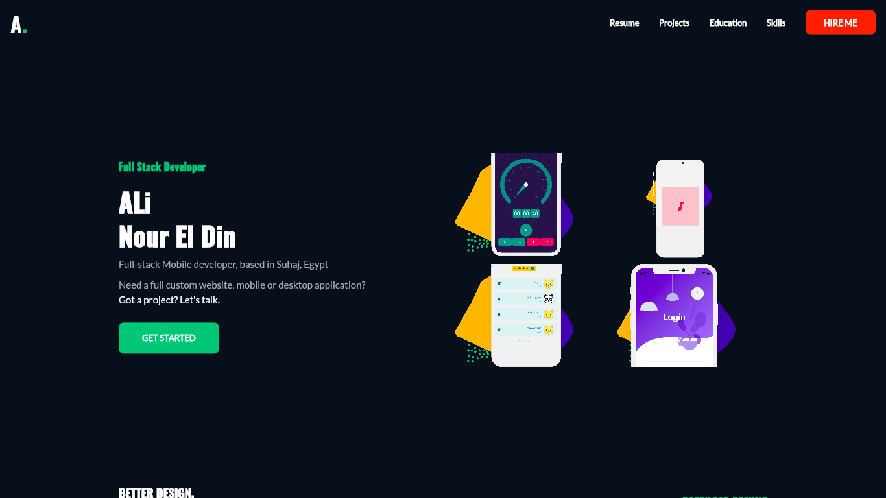

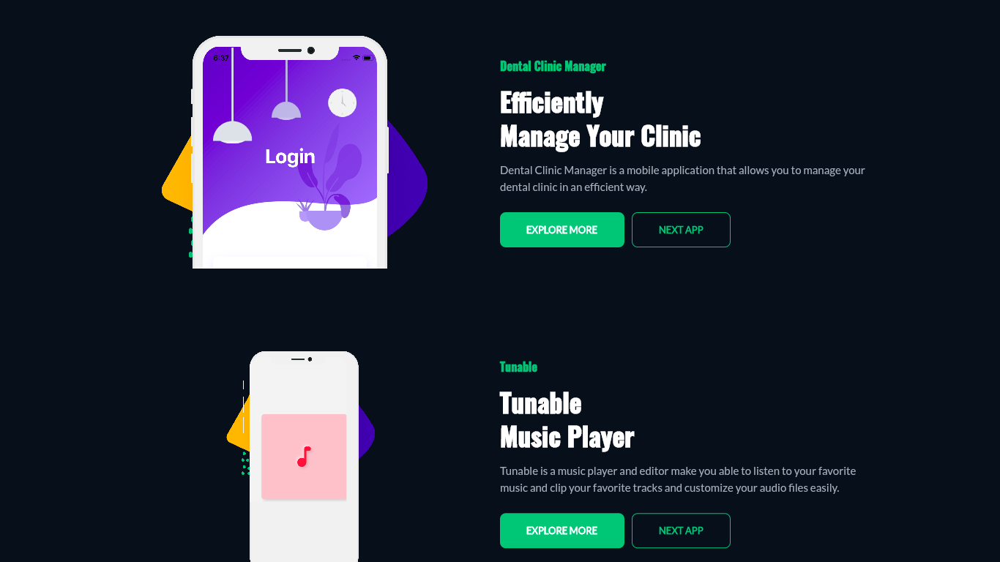
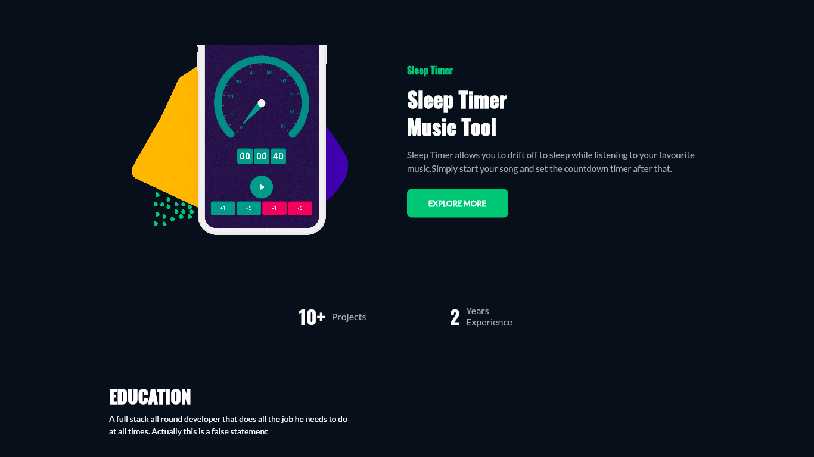
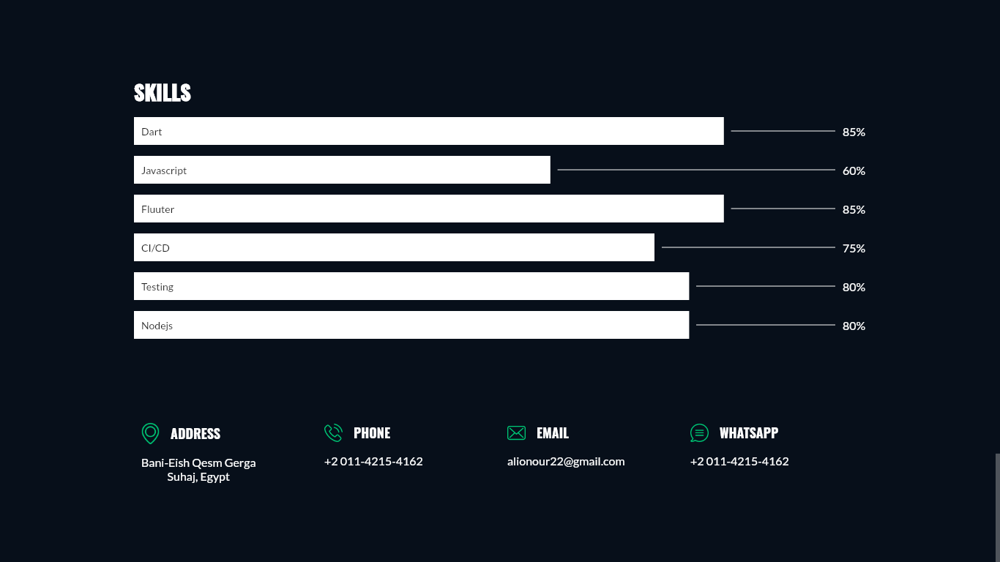
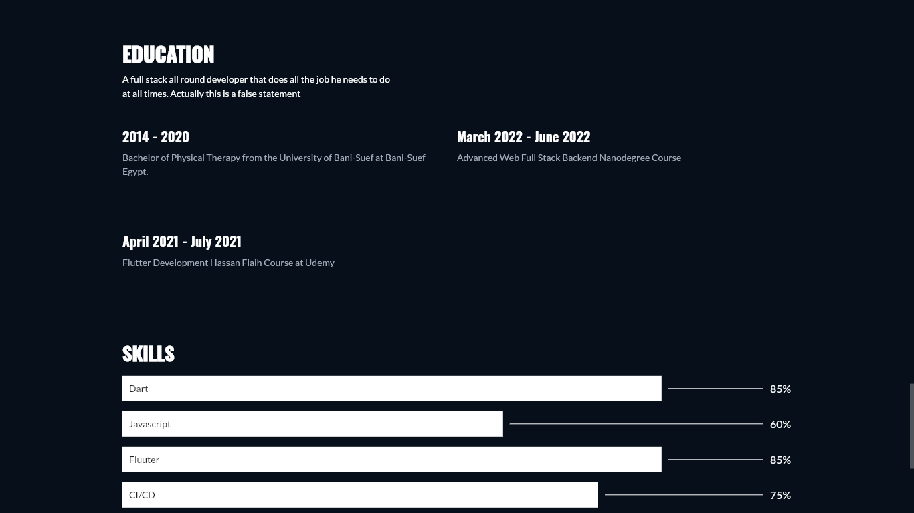

#### Mobile Screens
<!--  -->
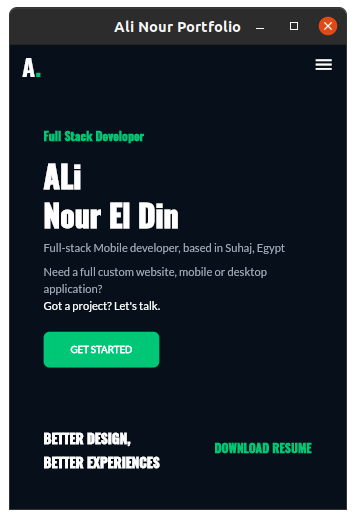
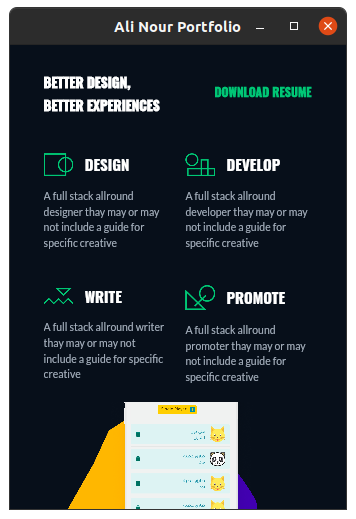
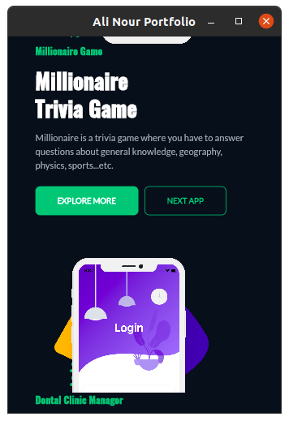
<!--  -->
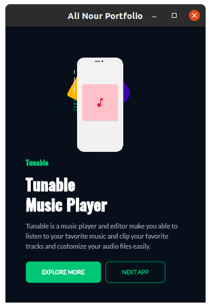
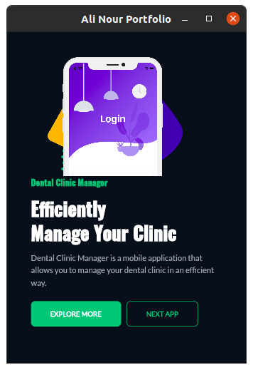
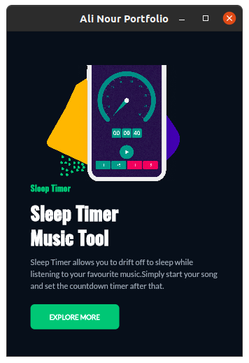
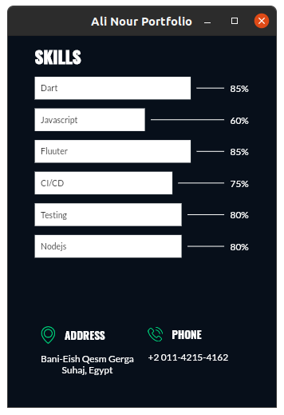

